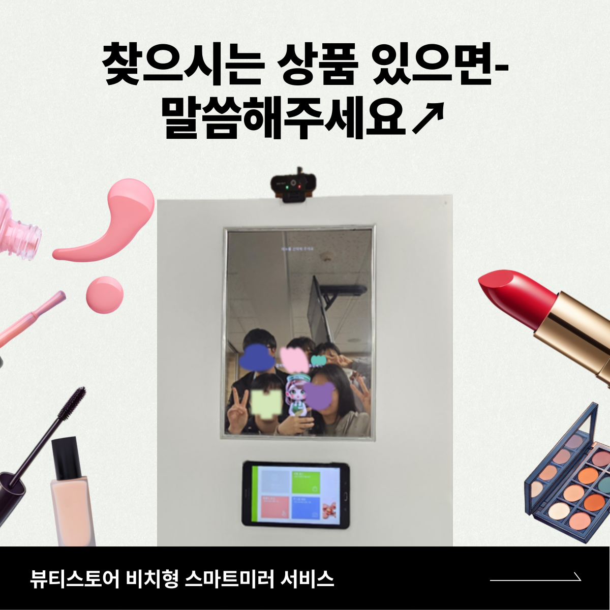
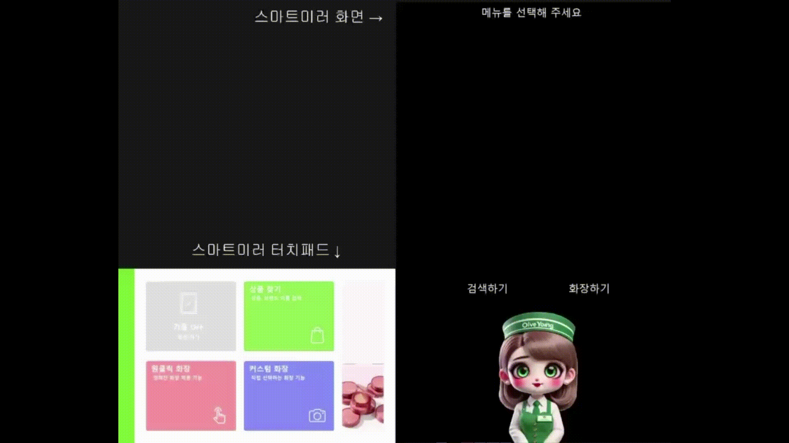
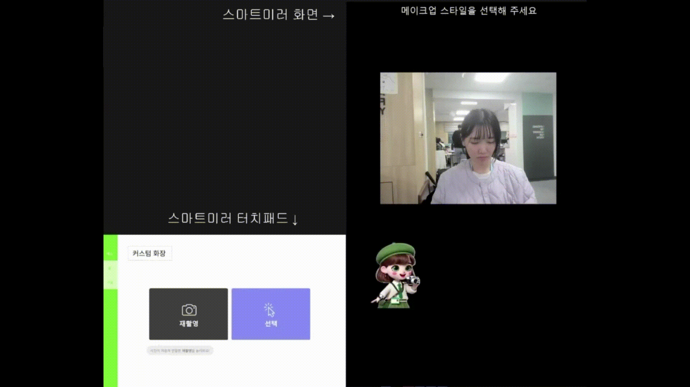
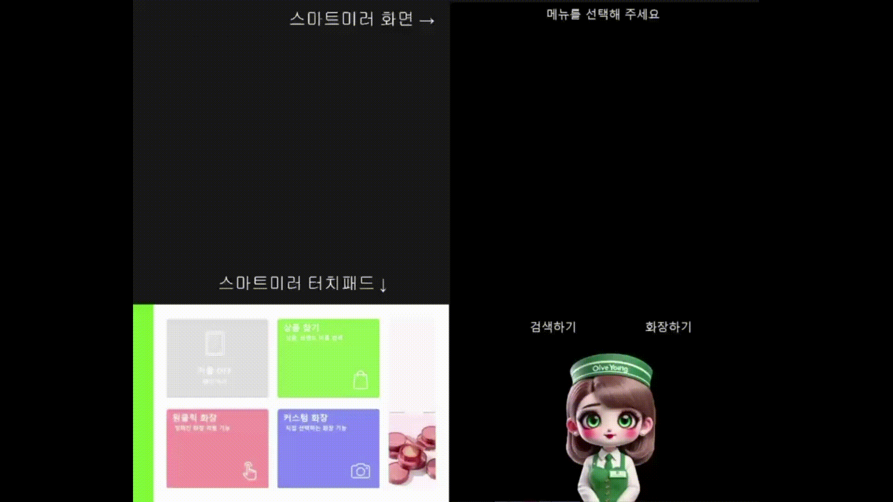
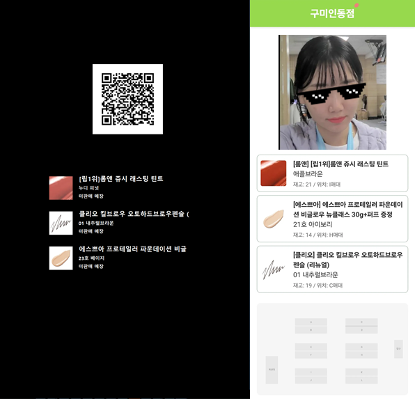
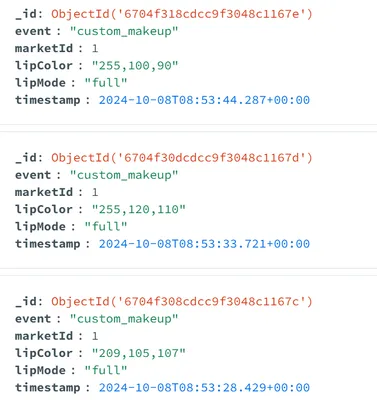
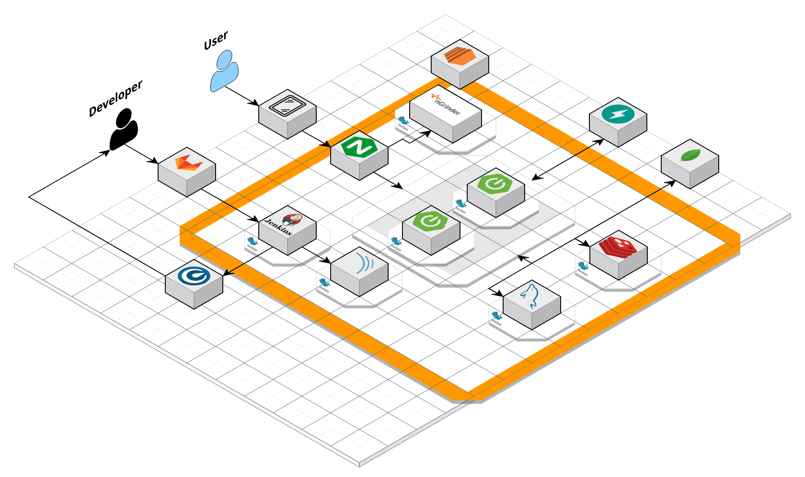
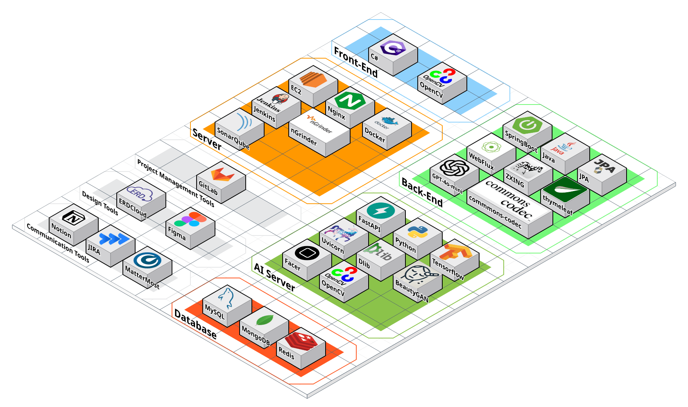
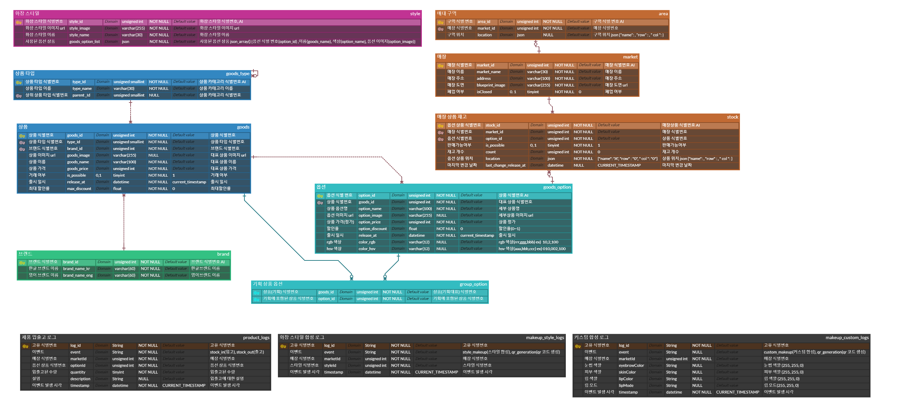
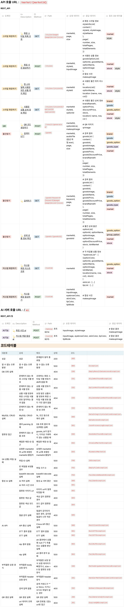

# 💄 “찾으시는 상품 있으면- 말씀해주세요↗” 서비스



## 📽️ **프로젝트 소개**

### **진행 기간**

2024.08.19 ~ 2024.10.11 (8주)

### **서비스 개요**

**[✨뷰티스토어 비치형 스마트미러 서비스✨]**

사용자가 연예인 사진을 선택해 원하는 화장 스타일을 합성하거나, 자신만의 화장품 색상을 선택해 커스텀 합성을 할 수 있는 기능을 제공합니다.   
합성된 화장 스타일을 통해 해당 상품 리스트를 확인할 수 있으며, QR 코드를 이용해 자신의 합성 사진과 해당하는 화장품 정보를 다운로드할 수 있습니다.   
또한, 음성 명령이나 키보드를 사용해 간편하게 상품을 검색하고, 현재 재고, 가격, 위치 등 제품 정보를 확인할 수 있습니다.

### 팀원 소개

||||||
 |:-:|:-:|:-:|:-:|:-:|
|[김종덕](https://github.com/Kimjongdeok11)|[김아름](https://github.com/aa001R)|[김찬민](https://github.com/simple0710)|[신혜민](https://github.com/heymin2)|[안치숙](https://github.com/sook000)|
|Frontend Developer|Backend Developer|Backend Developer|Frontend Developer|Backend Developer|

<details>
<summary><h3 style="display: inline-block;">✔역할 상세</h3></summary>
<div markdown="1">
<div class="team-member"> 
<h3>김종덕</h3>
<ul>
    <li>역할: 팀장, 프론트엔드 개발</li>
    <li>담당</li>
        <ul>
            <li>FE</li>
            <li>팀장</li>
        </ul>
</ul>
</div>
<div class="team-member"> 
<h3>김아름</h3>
<ul>
    <li>역할: 백엔드 개발</li>
    <li>담당</li>
        <ul>
            <li>DB 설계 및 구현</li>
            <li>Spring WebFlux를 이용하여 외부 API와 DB 조회 시 비동기&논블록킹 구조 적용</li>
            <li>Pre-fetching 및 Redis Cache를 이용하여 응답 성능 향상</li>
            <li>Full Text Search를 이용하여 DB 조회 성능 향상</li>
            <li>STT 및 사용자 질문 분석을 통해 검색할 화장품명 추출 프롬프트 작성
                <ul>
                    <li>ex) “내가 찾는 건 상큼 민트 반짝 립이야”<br/>
                    정확한 상품명(”상큼 민트 반짝 립”) 추출</li>
                </ul>
            </li>
            <li>Thyeleaf와 ZXing를 통한 QR 및 웹페이지 생성</li>
            <li>화장 스타일/커스텀 목록 조회 및 합성 결과 응답 API 구현</li>
            <li>(음성) 검색 결과 조회 및 상세 정보 조회 API 구현</li>
        </ul>
</ul>
</div>
<div class="team-member"> 
<h3>김찬민</h3>
<ul>
    <li>역할: 인프라, 데이터 수집</li>
    <li>담당</li>
        <ul>
            <li>DB 설계</li>
            <li>Jenkins를 이용한 CI/CD 파이프 라인 자동화 기능 구현</li>
            <li>Nginx를 통한 리버스 프록시 설정 기능 구현</li>
            <li>SonarQube를 활용한 코드 품질 검사 및 정적 분석 프로세스 구축</li>
            <li>nGrinder를 이용한 시스템 성능 및 부하 테스트 환경 구현</li>
            <li>Blue-Green 배포 방식을 적용한 무중단 배포 기능 구현</li>
            <li>Selenium을 이용한 데이터 수집</li>
        </ul>
</ul>
</div>
<div class="team-member"> 
<h3>신혜민</h3>
<ul>
    <li>역할: 프론트엔드 개발</li>
    <li>담당</li>
        <ul>
            <li>UI 개발</li>
            <li>검색 기능 개발
                <ul>
                    <li>음성 녹음</li>
                    <li>화상 키보드</li>
                </ul>
            </li>
        </ul>
</ul>
</div>
<div class="team-member"> 
<h3>안치숙</h3>
<ul>
    <li>역할: AI, 백엔드 개발</li>
    <li>담당</li>
        <ul>
            <li>DB 설계</li>
            <li>dlib을 이용하여 얼굴 탐지, 정렬 등 이미지 전처리</li>
            <li>BeautyGAN을 이용하여 사용자 사진과 화장 스타일 사진을 합성해 해당 화장 스타일을 적용한 사용자 사진 생성</li>
            <li>Facer의 Face Parsing을 이용하여 사용자 사진에 원하는 색깔을 지정해 피부, 눈썹, 입술 색깔 변경</li>
            <li>fastapi를 이용하여 원클릭 합성과 커스텀 합성 API 구현</li>
            <li>입력 이미지 해시 값을 이용해 fase parser 관련 파일(얼굴 segmentation 맵, 타임스탬프, 이미지 크롭 정보) 생성해 응답 속도 향상</li>
            <li>데몬 스레드로 캐싱 위해 저장했던 파일 주기적으로 검사해 만료된 파일 삭제</li>
            <li>MongoDB를 이용한 로그 생성</li>
        </ul>
</ul>
</div>
</div>>
</details>


****


## 📱 주요 기능 & UI

### 원클릭 화장 합성

저장된 인물 사진과 거울에 비친 자신의 모습을 합성하고 결과를 출력합니다. 합성된 사진, 사용된 화장품 리스트가 화면에 출력됩니다. QR로 사용자는 결과 정보를 받을 수 있습니다.

`# BeautyGAN`  `# Pre-fetching` `# Cache`



### 커스텀 화장 합성

원하는 색상과 얼굴 부위(피부, 눈썹, 입술)를 설정하고 커스텀 화장을 적용하여 결과를 출력합니다. 합성된 사진, 사용된 화장품 리스트가 화면에 출력됩니다. QR로 사용자는 결과 정보를 받을 수 있습니다.

`# facer` `# Daemon Thread`



### 음성/터치로 간편한 물건 검색

검색 버튼을 누른 뒤, 음성으로 원하는 물건을 찾을 수 있다. 또한, 가격이나 위치 정보를 확인하고 물건을 쉽게 찾을 수 있도록 구현하였습니다.

`# STT - Whisper모델` `# NLP 기반 사용자 질문 분석(Prompt)`  `# Full Text Search`



### QR

QR 코드를 통해 사용자는 합성 사진과 사용한 상품 목록을 간편하게 받을 수 있습니다.

`#Hashing` `#Cache` `#ZXING` `#Thymeleaf`



### 로그

원클릭 화장 합성, 커스텀 화장 합성 등의 기록을 남겨 자주 적용해 보는 화장 스타일이나, 색상을 관리할 수 있습니다.

`#MongoDB`

<p align="center"></p>


## 📖 참고 자료

[발표 자료 PPT](./발표자료.pdf)


## 🔀 시스템 구조도

<p align="center"></p>

## 🗂️ 기술 스택

<p align="center"></p>

## 🏞️ 개발 환경

#### **Front-End**

> Visual Studio
>

#### **Back-End**

> JDK: Eclipse Temurin 17.0.11 (LTS)
>
>
> SpringBoot: 3.3.3
>
> Gradle: 8.10
>
> IntelliJ: 2024.1.4 (Ultimate Edition)
>

#### **AI**

> FastAPI
>
>
> Conda: 24.7.1
>
> Python: 3.6.13 / 3.8.19
>
> VS Code: 1.90.2
>

#### **DB**

> MySQL: 8.0.39
>
>
> MongoDB: 7.0.14
>

#### **Infra**

> AWS EC: Ubuntu 20.04.6 LTS
>
>
> Docker: 27.2.1
>
> Jenkins: 2.477
>
> Nginx: 1.18.0 (Ubuntu)
>
서버 배포 기간: 2024.09.09 ~ 2024.10.18

## 📂 파일 구조

<table>
<tr>
<td>
<div>
<p style="font-weight: bold">frontend</p>

```bash
frontend
├───Config
├───Forms
│   ├───CustomsMakeup
│   ├───Main
│   ├───Makeup
│   ├───Mirror
│   ├───Search
│   ├───SearchDetail
│   ├───SearchInfo
│   ├───Style
│   └───Synthetic
├───Helpers
├───Models
├───Properties
└───Resources

```
</div>
</td>
<td>
<div>
<p style="font-weight: bold">backend</p>

```bash
backend
├───common
│   ├───config
│   ├───dto
│   │   ├───gan
│   │   └───nlp
│   ├───exception
│   └───service
└───domain
    ├───controller
    ├───dto
    ├───entity
    ├───repository
    └───service

```
</div>
</td>
</tr>
</table>


## 🐿️ ERD

<p align="center"></p>


## ☕ API 명세서

<p align="center"></p>


